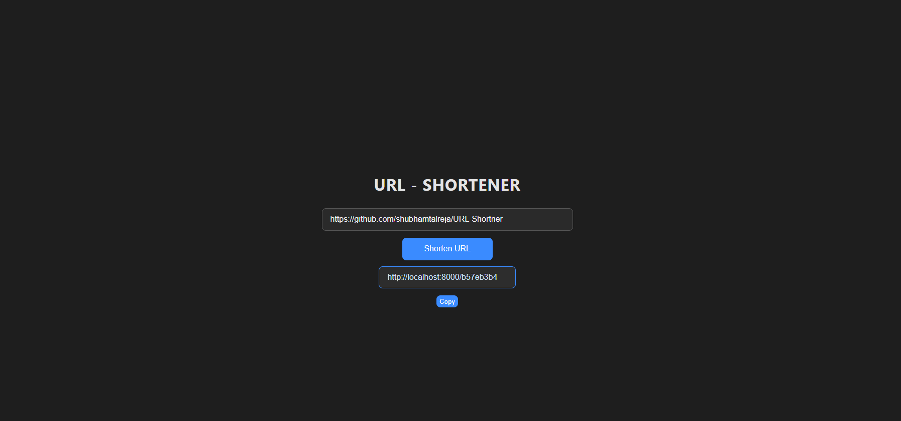

# URL Shortener (MERN)

A simple URL shortener built with the MERN stack:

- Frontend: React (Vite)
- Backend: Node.js + Express
- Database: MongoDB

This repository contains a small web app that creates shortened URLs and redirects to the original long URLs.

## Features

- Create a short URL for any long URL
- Redirect short URL to the original long URL
- Basic UI for submitting and listing short URLs

## Quickstart (Windows / PowerShell)

1. Clone the repository and open a PowerShell terminal in the project root.
2. Install dependencies for both client and server, then run the dev servers.

In two separate terminals run:

```powershell
# from project root
cd server; 
npm install; 
npm run dev

# in a separate terminal
cd client; 
npm install; 
npm run dev
```

Notes:
- The frontend runs (by default) on Vite's dev server (typically http://localhost:5173).
- The backend is configured to run on port 8000 by default.

## Environment Variables

You must create `.env` files in both `server/` and `client/` with the following contents.

server/.env
```
PORT=8000
CLIENT_URL=http://localhost:5173
MONGO_URI=mongodb://localhost:27017/urlShortner
URL_DOMAIN=http://localhost:8000
```

client/.env
```
VITE_API_BASE_URL=http://localhost:8000
```

The `VITE_API_BASE_URL` is the base URL the frontend uses to call the backend API.

## Folder Structure

Top-level layout:

```
README.md
client/          # React + Vite frontend
	├─ public/
	├─ src/
	├─ package.json

server/          # Node/Express backend
	├─ controllers/
	├─ models/
	├─ routes/
	├─ config/
	├─ server.js
	├─ package.json
```

Files of interest:
- `server/controllers/url.controller.js` — API logic for creating and resolving short URLs
- `server/models/url.model.js` — Mongoose schema for URL records
- `server/routes/url.routes.js` — Express routes (create + redirect endpoints)
- `client/src/components` — React UI components

## API Endpoints (examples)

Assuming `URL_DOMAIN=http://localhost:8000` and `VITE_API_BASE_URL=http://localhost:8000`:

- POST /create
	- Create a new short URL
	- Body (JSON): { "longUrl": "https://example.com/very/long/path" }
	- Response: short URL object with short code and full short URL

- GET /:id
	- Redirects to the original long URL (used by visiting the short URL)

Adjust paths if your server prefix differs. Check `server/routes/url.routes.js` for exact routes.

## Usage

1. Start MongoDB (e.g., with `mongod` or via a service like MongoDB Atlas). The `MONGO_URI` above uses a local instance.
2. Start server and client as shown in Quickstart.
3. Open the frontend (http://localhost:5173) and create short URLs using the UI.

## Development Notes

- The frontend uses Vite — environment variables that start with `VITE_` are exposed to client code.
- The backend uses Mongoose to connect to MongoDB — ensure your `MONGO_URI` is reachable.

## Screenshot

Below is a screenshot of the URL creation / listing page from the client UI:




